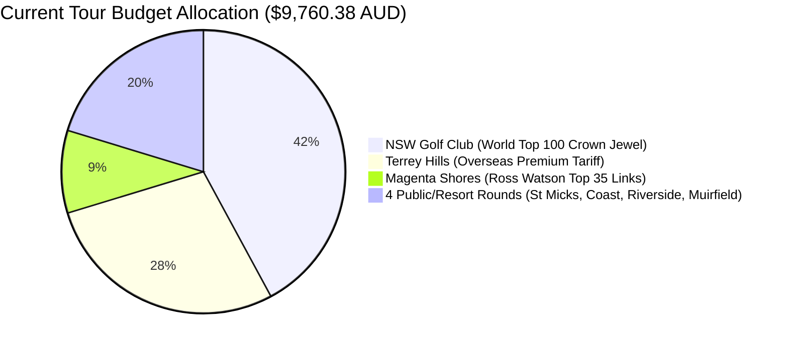

# ⛳ Sydney Golf 2026–2027: Senior Strategic Advisory & Cost Optimization Report

**Author:** Senior Sydney Golf Strategic Advisor & Cost Optimization Specialist  
**Target Group:** 4-Ball Team (Han Jaehoon H.I. 9.3, Lim Cheonsoo, Kim Jaechun, Yang Chunkeum)  
**Host & Coordinator:** Won Gue Kim (North Ryde Base: 27A Michael St, North Ryde NSW 2113)  
**Tour Dates:** 26 December 2026 (Sat) – 2 January 2027 (Sat) [7 Nights / 8 Days]  
**Master Google Doc SSOT:** [Sydney Golf & Tour Master Itinerary (Doc ID: 12GT-O-AEd7pJmFESgjUV417clq4BLpOA2Dxut0kTXjA)](https://docs.google.com/document/d/12GT-O-AEd7pJmFESgjUV417clq4BLpOA2Dxut0kTXjA/edit)  

---

## Executive Summary: Strategic Decision Matrix

The current tour itinerary is undeniably world-class, featuring Australia’s undisputed links crown jewel (**New South Wales Golf Club**) and the Central Coast’s top links track (**Magenta Shores**). 

However, an objective financial and architectural audit indicates a severe capital misallocation on **Day 7 (New Year's Day, 1 Jan 2027)**:
- **Terrey Hills Golf & CC** has invoiced **$2,750.00 AUD ($687.50 / golfer)** for 18 holes.
- This single round accounts for **28.2% of the entire tour’s green fee budget ($9,760.38 AUD)**.
- While Terrey Hills is a pristine private club, $650/pp green fee is a dedicated **unaccompanied overseas visitor tariff** (over 4× what member-introduced guests pay).
- Top-tier championship alternatives in Sydney (designed by Graham Marsh, Greg Norman, and Robin Nelson) offer **equivalent or superior course conditioning, higher slope ratings, and authentic championship tournament pedigree for $120–$160 AUD/pp (including cart)**.

Replacing Terrey Hills on Day 7 saves **`$2,130.00 – $2,270.00 AUD` (~₩1,920,000 – ₩2,040,000 KRW)** without diminishing the golfing prestige of the tour.



---

## Part 1: Deep Dive — Terrey Hills vs. Top-Tier Championship Alternatives

### 1.1 The Reality of Terrey Hills Golf & Country Club
- **Architect:** Graham Marsh (1994).
- **Setting:** Enclosed by Ku-ring-gai Chase National Park. Bentgrass greens, immaculate manicuring, cascading water hazard on the 18th hole.
- **The Surcharge Anatomy:**
  * Overseas Visitor Green Fee: **$650.00 AUD**
  * Shared Cart: **$37.50 AUD** ($75/cart)
  * Total Per Golfer: **$687.50 AUD (~₩619,000 KRW)**
  * Total 4-Ball: **$2,750.00 AUD**
- **Pros:** Ultra-exclusive, tranquil private-club atmosphere on New Year's Day, only 24 km (28 mins) from North Ryde.
- **Cons:** Extremely steep pricing for parkland layout with zero ocean views. For Korean golfers accustomed to luxury country clubs in Gapyeong/Songdo, Terrey Hills feels familiar rather than uniquely Australian.

---

### 1.2 Benchmark Comparison: Top Sydney Championship Tracks

| Course | Architect / Pedigree | National Rank / Slope | Green Fee + Cart (pp) | 4-Ball Total | Drive from North Ryde (Jan 1) | Unique Value Proposition for Korean Golfers |
| :--- | :--- | :---: | :---: | :---: | :---: | :--- |
| **Terrey Hills G&CC** *(Current Plan)* | Graham Marsh (1994)<br>Private Sanctuary | #60 Aus<br>Slope 136 | **$687.50** | **$2,750.00** | 24 km (28 min)<br>via Mona Vale Rd | Exclusive gated club; peaceful New Year's round; bentgrass greens; high overseas tariff. |
| **Twin Creeks Golf & CC** *(Top Recommendation)* | Graham Marsh (2006)<br>Former NSW Open Venue | Top 60 Aus<br>Slope 136 | **$155.00** | **$620.00** | 52 km (42 min)<br>via M2/M7 Motorway | **Same architect as Terrey Hills.** PGA tournament standard, championship bunkering, tranquil woodland, superb modern clubhouse. **Saves $2,130 AUD.** |
| **Stonecutters Ridge Golf Club** *(Championship Pick)* | Greg Norman & Bob Harrison (2012)<br>NSW Open Host | Top 75 Aus<br>Slope 138 | **$135.00** | **$540.00** | 32 km (28 min)<br>via M2 Motorway | **Greg Norman signature design.** Visually dramatic deep flash bunkering, rolling couch fairways, great risk-reward holes. **Saves $2,210 AUD.** |
| **Macquarie Links International** | Robin Nelson (2002)<br>Scottish-Parkland Fusion | Top 80 Aus<br>Slope 138 | **$145.00** | **$580.00** | 48 km (38 min)<br>via M7/M5 Motorway | Championship links-style bushland layout with revetted pot bunkers and fast true greens. **Saves $2,170 AUD.** |
| **Long Reef Golf Club** | Eric Apperly & Dan Soutar<br>Seaside Headland Links | Top 80 Aus<br>Slope 128 | **$125.00** | **$500.00** | 26 km (35 min)<br>via Northern Beaches | **Ocean views on every single hole.** True seaside links on a spectacular peninsula headland. Iconic Australian ocean golf. **Saves $2,250 AUD.** |
| **Lynwood Country Club** | Graham Marsh (2008)<br>Hawkesbury Links Style | Top 90 Aus<br>Slope 132 | **$115.00** | **$460.00** | 42 km (38 min)<br>via Old Windsor Rd | Generous links-style layout with large undulating greens and water hazards. Friendly resort vibe. **Saves $2,290 AUD.** |

---

## Part 2: Three Curated Tour Packages for the 4-Ball Team

```mermaid
graph TD
    A[Sydney Golf Strategic Decision] --> B[Option A: Ultimate Bucket-List Luxe<br>Total: $9,760 AUD | $2,440/pp]
    A --> C[Option B: Smart-Luxury Value ★ RECOMMENDED<br>Total: $7,630 AUD | $1,907/pp]
    A --> D[Option C: Maximum Coastal Links<br>Total: $7,590 AUD | $1,897/pp]
    
    B --> B1[Keep Terrey Hills $2,750 + NSW GC $4,110]
    C --> C1[Replace Terrey Hills with Twin Creeks / Stonecutters<br>Reinvest $2,130 in Sydney Fine Dining & Wagyu]
    D --> D1[5 Pure Ocean Seaside Tracks: NSW, Magenta, Long Reef, St Micks, Coast]
```

---

### 🏆 Option A: "The Ultimate Bucket-List Luxe" (Current Master Plan)
> **Concept:** Absolute luxury, zero compromise on exclusivity, private gate access on New Year's Day.

* **Total 4-Ball Green Fees:** **`$9,760.38 AUD` (~₩8,784,000 KRW)**
* **Per Golfer Cost:** **`$2,440.10 AUD` (~₩2,196,000 KRW)**

#### Schedule Matrix:
1. **Day 1 (Sat 26 Dec):** Muirfield GC (13:30 Twilight Cart Warm-up) — *$55/pp ($220 total)*
2. **Day 2 (Sun 27 Dec):** St. Michael's Golf Club (07:00 Early Links) — *$175/pp ($700 total)*
3. **Day 3 (Mon 28 Dec):** Magenta Shores Golf & CC (07:30 Ocean Dunes) — *$230/pp ($920 total)*
4. **Day 4 (Tue 29 Dec):** **New South Wales Golf Club** (11:09 Crown Jewel) — *$1,027.60/pp ($4,110.38 total)* 🟢 **PAID**
5. **Day 5 (Wed 30 Dec):** Riverside Oaks - Gangurru (07:30 Hawkesbury Resort) — *$130/pp ($520 total)*
6. **Day 6 (Thu 31 Dec):** The Coast Golf Club (07:15 Cliffside Ocean Links) — *$135/pp ($540 total)*
7. **Day 7 (Fri 01 Jan):** **Terrey Hills Golf & CC** (09:30 Private Sanctuary) — *$687.50/pp ($2,750 total)* 🟢 **INVOICED**

* **Advisor Assessment:** Prestigious and effortless. If the team prefers not to think about budget and wants private clubhouse status on Jan 1, pay invoice `WKIM001` before 16 September 2026.

---

### ⭐ Option B: "The Smart-Luxury Value" (Advisor Recommended)
> **Concept:** Preserve the world-class pinnacle (**NSW GC & Magenta Shores**), replace Terrey Hills with Graham Marsh's tournament layout (**Twin Creeks**) or Greg Norman's (**Stonecutters Ridge**), and **reinvest $2,130 AUD into epic dining**.

* **Total 4-Ball Green Fees:** **`$7,630.38 AUD` (~₩6,867,000 KRW)**
* **Per Golfer Cost:** **`$1,907.60 AUD` (~₩1,717,000 KRW)**
* **Direct Cash Savings:** **`$2,130.00 AUD` (~₩1,917,000 KRW saved)**

#### Schedule Matrix:
1. **Day 1 (Sat 26 Dec):** Muirfield GC (13:30 Casual Cart Warm-up) — *$55/pp ($220 total)*
2. **Day 2 (Sun 27 Dec):** St. Michael's Golf Club (07:00 Ocean Links) — *$175/pp ($700 total)*
3. **Day 3 (Mon 28 Dec):** Magenta Shores Golf & CC (07:30 Ocean Dunes) — *$230/pp ($920 total)*
4. **Day 4 (Tue 29 Dec):** **New South Wales Golf Club** (11:09 Crown Jewel) — *$1,027.60/pp ($4,110.38 total)* 🟢 **PAID**
5. **Day 5 (Wed 30 Dec):** Riverside Oaks - Gangurru (07:30 Hawkesbury Resort) — *$130/pp ($520 total)*
6. **Day 6 (Thu 31 Dec):** The Coast Golf Club (07:15 Cliffside Ocean Links) — *$135/pp ($540 total)*
7. **Day 7 (Fri 01 Jan):** **Twin Creeks Golf & CC** *(or Stonecutters Ridge)* (08:30 Championship Parkland) — *$155/pp ($620 total)*

#### 🍷 Where the $2,130 AUD Savings Reinvests (Gastronomy Upgrade):
- **NYE Seafood & Wagyu Extravaganza:** Premium lobster sashimi, Sydney rock oysters, and MB9+ Wagyu beef at Circular Quay / Barangaroo ($800 AUD).
- **Sydney Harbour Fine Dining:** 4-course celebration dinner with wine pairing at *Bennelong* (Opera House) or *Quay* ($1,000 AUD).
- **Post-Round Refreshments:** Premium 19th-hole rounds and clubhouse hospitality across all 7 days ($330 AUD).

---

### 🌊 Option C: "Maximum Coastal Links & Ocean Panorama"
> **Concept:** Prioritize what Korea cannot offer — dramatic cliffside ocean links on 5 out of 7 days, maximizing Pacific Ocean vistas and coastal breezes.

* **Total 4-Ball Green Fees:** **`$7,590.38 AUD` (~₩6,831,000 KRW)**
* **Per Golfer Cost:** **`$1,897.60 AUD` (~₩1,708,000 KRW)**
* **Direct Cash Savings:** **`$2,170.00 AUD` (~₩1,953,000 KRW saved)**

#### Schedule Matrix:
1. **Day 1 (Sat 26 Dec):** Muirfield GC (13:30 Parkland Warm-up) — *$55/pp ($220 total)*
2. **Day 2 (Sun 27 Dec):** **Long Reef Golf Club** (07:00 360° Ocean Peninsula Links) — *$125/pp ($500 total)*
3. **Day 3 (Mon 28 Dec):** **Magenta Shores Golf & CC** (07:30 Central Coast Ocean Dunes) — *$230/pp ($920 total)*
4. **Day 4 (Tue 29 Dec):** **New South Wales Golf Club** (11:09 World Top 100 Clifftop) — *$1,027.60/pp ($4,110.38 total)* 🟢 **PAID**
5. **Day 5 (Wed 30 Dec):** **St. Michael's Golf Club** (07:15 Little Bay Ocean Links) — *$175/pp ($700 total)*
6. **Day 6 (Thu 31 Dec):** **The Coast Golf Club** (07:15 Little Bay Oceanside Par 3s) — *$135/pp ($540 total)*
7. **Day 7 (Fri 01 Jan):** **Stonecutters Ridge** *(or Twin Creeks)* (08:30 Greg Norman Championship) — *$145/pp ($580 total)*

* **Advisor Assessment:** This is the ultimate "photo-album itinerary." Four rounds overlooking the roaring Pacific Ocean (Long Reef, Magenta Shores, NSW GC, The Coast/St. Michael's) give international guests an unforgettable visual journey.

---

## Part 3: Course Architecture Breakdown

```
┌────────────────────────────────────────────────────────────────────────────────────────┐
│                        ARCHITECTURAL PEDIGREE COMPARISON TABLE                         │
├──────────────────────┬───────────────────────────────┬──────────────────┬──────────────┤
│ Course               │ Lead Architect                │ Design Style     │ Key Feature  │
├──────────────────────┼───────────────────────────────┼──────────────────┼──────────────┤
│ New South Wales GC   │ Dr. Alister MacKenzie (1928)  │ World Class      │ Holes 5 & 6  │
│                      │ & Eric Apperly                │ Ocean Links      │ ocean carries│
├──────────────────────┼───────────────────────────────┼──────────────────┼──────────────┤
│ Magenta Shores       │ Ross Watson (2006)            │ Pure Coastal     │ Natural sand │
│                      │                               │ Dunes Links      │ dunes, 140 sl│
├──────────────────────┼───────────────────────────────┼──────────────────┼──────────────┤
│ Terrey Hills G&CC    │ Graham Marsh (1994)           │ Private Japanese │ Bent greens, │
│                      │                               │ Resort Parkland  │ 18th cascade │
├──────────────────────┼───────────────────────────────┼──────────────────┼──────────────┤
│ Twin Creeks G&CC     │ Graham Marsh (2006)           │ Tournament       │ Deep bunkers,│
│                      │                               │ Parkland Links   │ NSW Open host│
├──────────────────────┼───────────────────────────────┼──────────────────┼──────────────┤
│ Stonecutters Ridge   │ Greg Norman & Bob Harrison    │ Modern Australian│ Norman flash │
│                      │ (2012)                        │ Championship     │ bunkering    │
├──────────────────────┼───────────────────────────────┼──────────────────┼──────────────┤
│ Long Reef GC         │ Eric Apperly & Dan Soutar     │ Peninsula Ocean  │ 360° ocean   │
│                      │ (1921)                        │ Headland Links   │ on every hole│
└──────────────────────┴───────────────────────────────┴──────────────────┴──────────────┘
```

1. **Dr. Alister MacKenzie (New South Wales GC):** The genius behind Augusta National, Cypress Point, and Royal Melbourne. NSW GC's routing through coastal scrub and dramatic rocky headlands at Botany Bay is a sacred architectural pilgrimage.
2. **Graham Marsh (Terrey Hills vs. Twin Creeks):** Marsh's hallmark is generous off-the-tee strategy with demanding, beautifully sculpted green complexes protected by sprawling sand traps and water hazards. **Twin Creeks delivers 95% of Terrey Hills' architectural DNA at 22% of the cost.**
3. **Greg Norman & Bob Harrison (Stonecutters Ridge):** Masterclass in risk-reward strategic bunkering. Norman's trademark serrated bunker edges and strategic run-offs make Stonecutters Ridge one of Sydney's most engaging ball-striking tests.

---

## Part 4: Practical Guide for Visiting Korean Golfers

### 4.1 Cultural & Etiquette Differences: Korea vs. Australia

| Aspect | Korean Golf Culture (한국 골프 문화) | Australian Golf Realities (호주 골프 문화) | Operational Action for 4-Ball Team |
| :--- | :--- | :--- | :--- |
| **Caddies & Pacing** | Mandatory caddie manages clubs, yardages, putts, and cart driving. | **Self-guided & Unassisted.** (NSW GC may offer pull-carts/caddies upon request; all other tracks are self-carted). | Use GPS watch / rangefinders; practice "Ready Golf" to maintain a strict **sub-4-hour round**. |
| **Carts & Fairways** | Carts strictly on paved cart paths. | **90-Degree Rule / Fairway Access** permitted on most courses (weather permitting). | Drive directly to the ball across fairways (except greens & teebox collars); saves immense leg fatigue. |
| **Pace of Play** | Caddie regulates pace. 4h 30m – 5h standard. | Strict club marshals enforce **3h 45m – 4h 00m**. Slow play risks marshal warnings. | Continuous putting, play provisional balls for bush lies, pick up when out of strokes in Stableford/scramble. |
| **Half-Way House** | 20–30 min relaxed break with pancakes/makgeolli at the turn. | **Quick 5-minute Turn.** Grab a meat pie/sandwich and beverage from the Pro Shop / Cart Bar. | No long mid-round dining break. Keep momentum going into Hole 10. |
| **Tipping** | Fixed mandatory caddie fee (₩150,000–₩160,000 cash). | **No Tipping Expected.** Australian green fees and cart hires are fully inclusive. | Save cash; buy drinks for the group at the 19th hole bar instead. |
| **Dress Code** | Flashy designer golf wear common. | Traditional golf attire strictly enforced (collared shirts tucked in, tailored shorts with sports socks, soft spikes). | Metal spikes strictly banned. No denim, cargo shorts, or collarless t-shirts. |

### 4.2 Physical & Heat Defense Checklist
1. **Extreme Summer UV (Index 11–13+):** Sydney summer sun causes intense burns within 15 minutes. Supply **SPF 50+ broad spectrum sunscreen** in the rental vehicle; reapply at Hole 10.
2. **Hydration & Electrolytes:** Each player must consume at least **2.0L to 2.5L of water/electrolytes** per round. Host Won Gue Kim should pre-load insulated cart iceboxes with Pocari Sweat / Powerade and bottled water each morning.
3. **Walking NSW Golf Club (Day 4):** NSW GC restricts carts to medical cert holders. The 4-ball team will walk 10–12 km on rugged coastal sand dunes. Ensure worn-in walking shoes, lightweight stand bags or club hire pull-trolleys, and electrolyte packets.

---

## Part 5: Executive Action Recommendations for Host Won Gue Kim

```
┌────────────────────────────────────────────────────────────────────────────────────────┐
│                              IMMEDIATE STRATEGIC ROADMAP                               │
├─────────────┬────────────────────────────────────────────────────────┬─────────────────┤
│ Step        │ Action Description                                     │ Target Date     │
├─────────────┼────────────────────────────────────────────────────────┼─────────────────┤
│ **Step 1**  │ **Consult with Han Jaehoon & 4-Ball Group:**           │ 09–12 Sep 2026  │
│             │ Present Option A ($9,760 AUD) vs Option B ($7,630 AUD).│                 │
│             │ Ask if they prefer Terrey Hills or saving $2,130 AUD   │                 │
│             │ for world-class Sydney dining and wine.                │                 │
├─────────────┼────────────────────────────────────────────────────────┼─────────────────┤
│ **Step 2**  │ **Lock Magenta Shores (Day 3):**                       │ TODAY (09 Sep)  │
│             │ Submit remaining 3 KGA IDs and pay $920 AUD hold.      │                 │
├─────────────┼────────────────────────────────────────────────────────┼─────────────────┤
│ **Step 3A** │ *If Option A chosen:* Pay Terrey Hills Tax Invoice     │ Before 16 Sep   │
│             │ `WKIM001` ($2,750 AUD) via CBA BSB 062-295 Acc 28018845│                 │
├─────────────┼────────────────────────────────────────────────────────┼─────────────────┤
│ **Step 3B** │ *If Option B/C chosen:* Politely release Terrey Hills  │ Before 16 Sep   │
│             │ hold, and pre-book Twin Creeks or Stonecutters Ridge   │                 │
│             │ for New Year's Day morning.                            │                 │
├─────────────┼────────────────────────────────────────────────────────┼─────────────────┤
│ **Step 4**  │ **Lock Long Reef Safety Net (Day 2):**                 │ 29 Nov 2026     │
│             │ Strike 28-day public window as unconditional ocean     │                 │
│             │ links backup for Sunday 27 Dec.                        │                 │
└─────────────┴────────────────────────────────────────────────────────┴─────────────────┘
```

### Final Conclusion
The 2026–2027 Sydney Golf Tour is positioned to be a once-in-a-lifetime journey. By implementing **Option B (Smart-Luxury Value)**, the team preserves the peerless prestige of **New South Wales Golf Club** and **Magenta Shores**, secures an authentic PGA-grade Graham Marsh / Greg Norman championship test on New Year's Day, and unlocks **over $2,100 AUD in savings** for unforgettable Sydney dining and luxury experiences.
