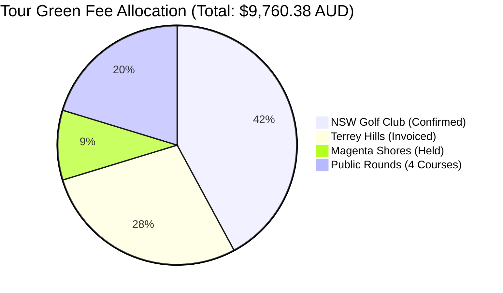
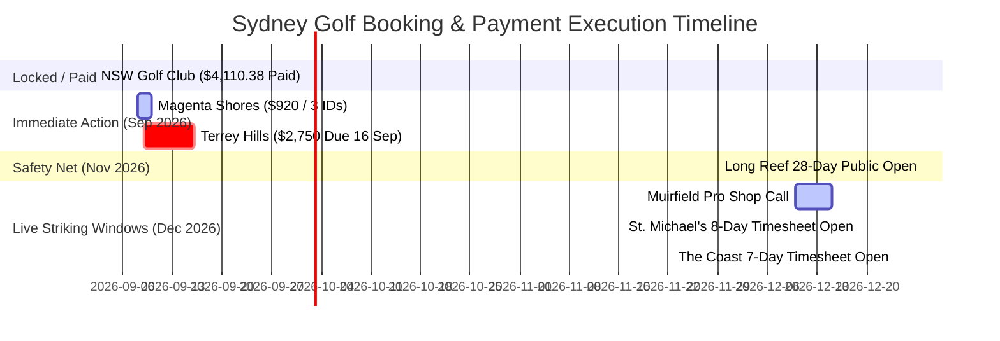
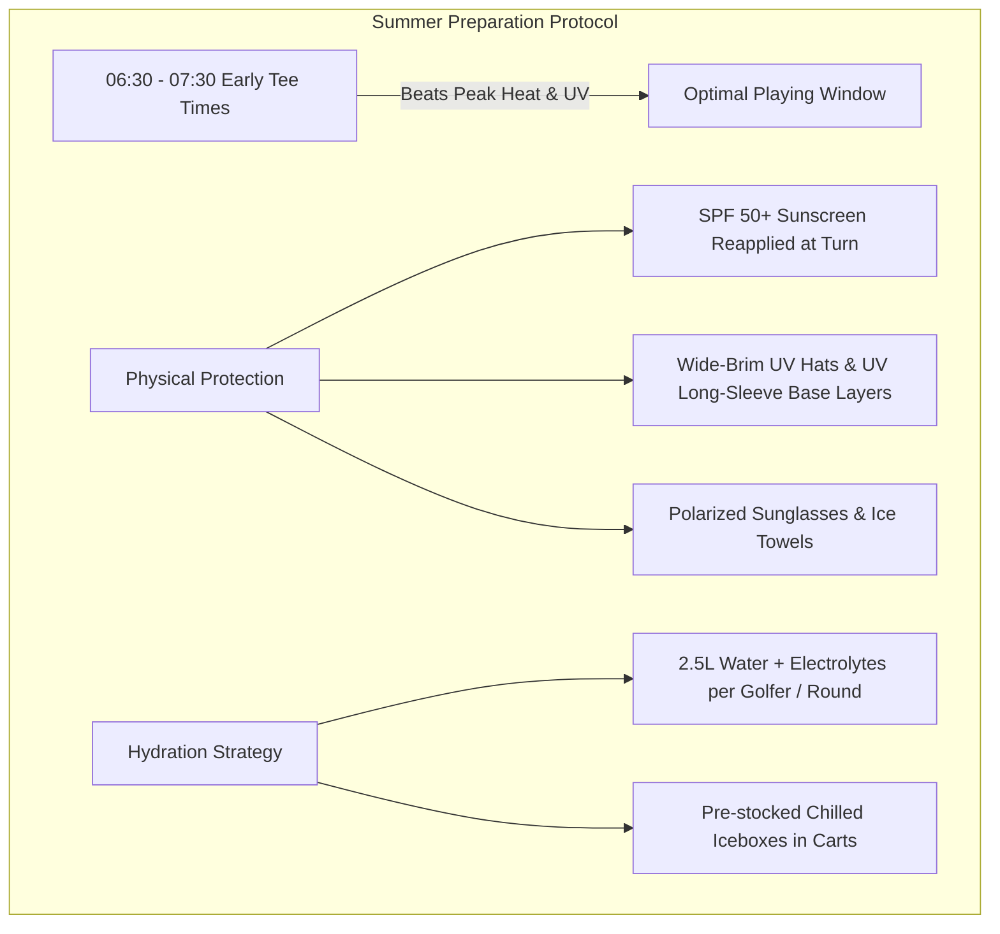

# 🏌️‍♂️ Sydney Golf & Tour 2026-2027: Critical Operational, Financial & Physiological Review

**Review Date:** 9 September 2026  
**Auditor:** Critical Itinerary & Cost Reviewer Agent (Antigravity AI)  
**Target Window:** 26 December 2026 (Sat) – 2 January 2027 (Sat) [7 Nights / 8 Days]  
**Host / Chauffeur / Non-playing Coordinator:** Won Gue Kim (North Rocks / North Ryde Base)  
**4-Ball Golfer Team:** Han Jaehoon (H.I. 9.3), Lim Cheonsoo, Kim Jaechun, Yang Chunkeum  
**Base Accommodation:** 27A Michael Street, North Ryde NSW 2113 (Airbnb, Confirmed 9,440,000 KRW / ~$10,500 AUD)

---

## Executive Summary & Overall Risk Matrix

The **Sydney Golf & Tour 2026–2027** is an ambitious, world-class golf itinerary featuring Australia's premier championship layouts (New South Wales GC, Terrey Hills, Magenta Shores, St. Michael's). However, a rigorous stress-test against real-world Sydney holiday peak conditions, physiological demands, financial allocation, and booking window mechanics reveals **critical friction points and operational risks** that require immediate proactive management.

| Domain | Risk Level | Primary Vulnerability | Immediate Mitigation Required |
| :--- | :---: | :--- | :--- |
| **1. Financial Concentration** | **MEDIUM-HIGH** | Two clubs (NSW GC + Terrey Hills) consume **70.3%** ($6,860.38) of total green fees ($9,760.38). | Re-evaluate Terrey Hills overseas rate ($687.50/pp) vs member-guest or alternative Tier-1 tracks; settle due payments on schedule. |
| **2. Physical & Fatigue Shock** | **CRITICAL** | **7 consecutive 18-hole rounds** starting 5 hours after an overnight 10.5-hour long-haul flight (OZ601). Walking NSW GC on Day 4. | Mandate motorized carts everywhere possible; adjust Day 1 to optional 9 holes/range or twilight cart scramble; implement hydration & recovery protocols. |
| **3. Peak Holiday Logistics** | **HIGH** | North Ryde base to Central Coast (M1 North bottleneck on Boxing Day holiday weekend Mon 28 Dec) and Eastern Suburbs coastal links. | Shift departure times 45–60 mins earlier; plan non-toll / alternative arterial routes; leverage M2/Lane Cove Tunnel/Eastern Distributor. |
| **4. Booking Timesheet Windows** | **HIGH** | Heavy reliance on 7-day to 8-day open public timesheets (St. Michael's, The Coast) competing against high holiday demand and member comps. | Pre-lock Long Reef on 29 Nov (28-day window) as St. Michael's safety net; set automated alarms for St. Michael's (19 Dec) and The Coast (24 Dec). |
| **5. Summer Climate & Heat/UV** | **HIGH** | Late December Sydney heat (30°C–38°C), extreme UV index (11–13+), afternoon coastal sea breezes (25–35 km/h gusts). | Strict early-morning tee-times (06:30–07:30 AM); UV shirts, wide-brim hats, electrolyte supplements; cart iceboxes stocked daily. |

---

## 1. 💰 Financial & Value-for-Money Analysis

### 1.1. Green Fee Budget Concentration

```
Total Tour Green Fee Budget: $9,760.38 AUD (~₩8,784,000 KRW)
├── 🟢 NSW Golf Club (World Top 100):      $4,110.38 AUD (42.1%) — Confirmed & Paid
├── 🟢 Terrey Hills Golf & CC:              $2,750.00 AUD (28.2%) — Invoiced (Due 16 Sep)
├── 🟢 Magenta Shores Golf & CC:             $920.00 AUD  (9.4%) — Tentatively Held
└── 🎯 Estimated 4 Public Rounds:           $1,980.00 AUD (20.3%) — St. Michael's, The Coast, Riverside, Muirfield
```



### 1.2. Cost-Benefit & Overseas Surcharge Assessment

1. **New South Wales Golf Club ($1,027.60 / player — Confirmed & Paid):**
   - **Verdict: EXCEPTIONAL VALUE / BUCKET-LIST MANDATORY.**
   - *Rationale*: Ranked #5 in Australia and #33 in the world (Alister MacKenzie masterpiece). Securing a holiday tee time at NSW GC as international visitors is extraordinarily difficult. While $1,027.60/pp is high, it is comparable to global bucket-list venues (Pebble Beach $625+ USD, St Andrews Old Course packages). This is the undisputed crown jewel of the trip.

2. **Terrey Hills Golf & Country Club ($687.50 / player [$650 Green + $37.50 Cart] — Invoiced):**
   - **Verdict: HIGH COST / PREMIUM SURCHARGE — ACTION REQUIRED.**
   - *Rationale*: Terrey Hills is an immaculate private Graham Marsh design in Ku-ring-gai Chase National Park. However, $650/pp green fee is a dedicated "International Visitor / Unaccompanied Overseas Guest" rate.
   - *Comparison*: A member-introduced guest pays ~$150–$200 AUD. Standard premium resort courses in Sydney (e.g., Twin Creeks, Riverside Oaks, Stonecutters Ridge, Lynwood) cost between $110 and $180 AUD including cart.
   - *Risk/Action*: Terrey Hills Tax Invoice `WKIM001` ($2,750.00 AUD) is payable within 7 days (by **16 September 2026**). If the group values the ultra-exclusive private sanctuary vibe on New Year's Day (when most public courses are packed), it is justifiable. If cost optimization is desired, alternative high-slope championship venues like **Twin Creeks** ($140/pp) or **Macquarie Links** ($130/pp) would save ~$2,150 AUD for the team.

3. **Magenta Shores Golf & Country Club ($230.00 / player — Confirmed Hold):**
   - **Verdict: SUPERB VALUE.**
   - *Rationale*: Australia Top 35 true links (Slope 140) by Ross Watson. At $230/pp including shared cart, this provides world-class coastal dunes golf at 22% of NSW GC's rate.

4. **Public & Semi-Private Courses (~$55 to $175 / player):**
   - St. Michael's (~$175), The Coast (~$135), Riverside Oaks (~$130), Muirfield (~$55).
   - **Verdict: HIGH ROI.** These public/open timesheet rates maximize the quality-to-cost ratio, balancing out the luxury expenditure on NSW GC and Terrey Hills.

---

## 2. 🚗 Logistics, Commute & Holiday Traffic Realities

### 2.1. Base Location Evaluation: 27A Michael Street, North Ryde
- **Strategic Advantage:** Centrally positioned near the M2 Hills Motorway, Lane Cove Tunnel, and A3 corridor. Provides clean multi-directional radial access to the North (M1), West (M2/M7 to Hawkesbury), and South/East (Lane Cove Tunnel ➔ Eastern Distributor ➔ Little Bay / La Perouse).
- **Accommodation Status:** 7 Nights Entire House Airbnb fully confirmed (`9,440,000 KRW` / ~$10,500 AUD). Provides single-base stability with no mid-trip luggage repacking.

### 2.2. Route-by-Route Peak Holiday Stress Analysis

```
                                  [NORTH]
                             Magenta Shores (Day 3)
                              (95 km | 1h 20m - 2h 00m)
                                     ▲
                                     │ M1 Pacific Motorway
                                     │ (Holiday Exodus Bottleneck)
                                     │
    [WEST]                           │                     [EAST / NORTHERN BEACHES]
 Riverside Oaks (Day 5)      [NORTH RYDE BASE] ──────────► Terrey Hills (Day 7)
 (58 km | 1h 00m)            (27A Michael St)               (24 km | 30m - 40m)
 Muirfield (Day 1)                   │                     Long Reef (Backup Day 2)
 (11 km | 18m)                       │                      (26 km | 40m - 55m)
                                     │ Lane Cove Tunnel /
                                     │ Eastern Distributor
                                     ▼
                          St. Michael's (Day 2)
                          NSW Golf Club (Day 4)
                          The Coast GC (Day 6)
                          (31-33 km | 40m - 1h 10m)
                                  [SOUTH-EAST]
```

1. **Day 3 (Mon 28 Dec) — North Ryde to Magenta Shores (Central Coast):**
   - **Distance:** 95 km each way.
   - **Tee Time:** 07:30 AM.
   - **Holiday Traffic Risk:** **VERY HIGH (M1 Northbound Holiday Peak).** The Monday following Boxing Day is one of the heaviest holiday getaway days on the M1 Pacific Motorway towards the Central Coast and Newcastle.
   - **Logistical Directive:** Target departure from North Ryde no later than **05:30 AM** (allows 90-minute drive buffer + 30-minute warmup). Returning south in the late afternoon (after 14:00) will encounter moderate traffic returning to Sydney.

2. **Days 2, 4, 6 (Sun 27, Tue 29, Thu 31 Dec) — North Ryde to Eastern Suburbs (Little Bay / La Perouse):**
   - **Distance:** 31–33 km each way.
   - **Route:** M2 ➔ Lane Cove Tunnel ➔ Gore Hill Fwy ➔ Sydney Harbour Bridge / Tunnel ➔ Eastern Distributor ➔ Anzac Parade / Bunnerong Rd.
   - **Traffic Risk:** **MODERATE.** Morning outbound traffic (06:00–07:00 AM) is generally light. Afternoon returns from Little Bay between 14:00–16:00 will see heavier congestion around the Eastern Distributor and Military Road / Harbour Bridge corridors.
   - **Logistical Directive:** Allow **50–65 minutes** commute time for morning tee times.

3. **Day 5 (Wed 30 Dec) — North Ryde to Riverside Oaks (Hawkesbury River) ➔ Bondi Beach:**
   - **Distance:** 58 km (North Ryde ➔ Cattai), followed by 62 km (Cattai ➔ North Ryde ➔ Bondi Beach).
   - **Commute Burden:** Total daily driving of ~130 km.
   - **Logistical Directive:** Won Gue Kim's non-playing chauffeur role is vital here. Ensure golfers have seamless transfer back to North Ryde to shower before the 16:30 Bondi Beach excursion.

4. **Day 7 (Fri 01 Jan - New Year's Day) — North Ryde to Terrey Hills:**
   - **Distance:** 24 km via A3 / Ryde Rd / Mona Vale Rd.
   - **Tee Time:** 09:30 AM.
   - **Traffic Risk:** **LOW.** New Year's morning traffic across suburban Sydney is notoriously quiet. Commute should take 25–35 minutes max.

---

## 3. 🧠 Fatigue & Physiological Review: 7 Consecutive Rounds

### 3.1. The Cumulative Fatigue Curve

```
Fatigue Level
  10 |                                              [Peak Strain]
   8 |                                      * Day 4 (NSW GC Walking)
   6 |                                * Day 3 (Magenta Shores 05:30 Wakeup)
   4 |                          * Day 2 (St. Michael's Links)
   2 |    * Day 1 (Post-Flight Warmup)
   0 └───┴──────────────────────┴───────────┴───────────┴───────────┴───────────┴───► Days
        Sat 26 Dec            Sun 27      Mon 28      Tue 29      Wed 30      Thu 31   Fri 01
        (OZ601 08:20 AM)                                                           (NYE)   (Terrey Hills)
```

### 3.2. Critical Strain Milestones

1. **Day 1 Shock (Sat 26 Dec — Boxing Day):**
   - Flight OZ601 arrives at 08:20 AM after an overnight 10h 20m flight.
   - Customs/luggage clearance takes 60–90 mins (peak holiday terminal volume). Arrival at North Ryde ~11:00 AM.
   - **Risk:** Playing 18 holes at Muirfield at 13:30 PM under intense afternoon sun with severe jetlag/sleep deprivation creates an acute injury and heat exhaustion risk.
   - **Mitigation:** Treat Muirfield strictly as a loose, casual 9-to-18 hole warm-up scramble with **mandatory carts**. Allow players to drop out after 9 holes if eyelids are heavy.

2. **Day 4 Pinnacle (Tue 29 Dec — NSW Golf Club):**
   - **Walking Requirement:** NSW Golf Club is a championship coastal links layout that strictly restricts motorized carts (subject to medical certificate / caddie/buggy walking tradition).
   - **Physical Load:** 18 holes on steep coastal dunes at La Perouse in the midday sun (11:09 AM tee time) involves ~10–12 km of rigorous walking across undulating terrain with zero shade.
   - **Mitigation:** Book club pull-buggies or electric caddies well in advance; carry 2.5L+ hydration per golfer; ensure comfortable, broken-in walking golf shoes.

3. **Cumulative Toll by Day 6 & 7 (31 Dec & 1 Jan):**
   - By Day 6 (The Coast GC) and Day 7 (Terrey Hills), the 4 golfers will have played 90–108 holes over 6 days.
   - Combined with the New Year's Eve BBQ and late night on Dec 31, a 09:30 AM tee time at Terrey Hills (Slope 136) on Jan 1 will test mental stamina.
   - **Mitigation:** Ensure Day 5 (Riverside Oaks) and Day 6 (The Coast) are played at a leisurely, relaxed pace with motorized carts and early afternoon rest.

---

## 4. 📅 Booking Timesheet Realities & Window Execution

### 4.1. Timesheet Timeline & Execution Calendar



### 4.2. Deep Dive into Timesheet Vulnerabilities

1. **St. Michael's GC (Day 2 — Sun 27 Dec):**
   - **Vulnerability:** Sundays at St. Michael's are heavily subscribed for Member Competitions in the morning. Advance visitor bookings incur a $335/pp surcharge.
   - **Execution Window:** The public timesheet opens **8 days prior: Saturday 19 December 2026 @ 4:00 PM AEDT**.
   - **Risk:** Public morning slots (06:45–07:45 AM) can be snapped up in seconds by local social golfers.
   - **Safety Net Strategy:** On **Sunday 29 November 2026 (28 days prior)**, immediately lock a 4-ball morning slot at **Long Reef Golf Club** as an unconditional ocean links backup. If St. Michael's is secured on 19 Dec, evaluate cancellation policy for Long Reef.

2. **The Coast Golf Club (Day 6 — Thu 31 Dec / NYE):**
   - **Vulnerability:** New Year's Eve public holiday demand. The public booking window opens **7 days prior: Thursday 24 December 2026**.
   - **Payment Rule:** The Coast online booking portal does not accept AMEX (Visa/Mastercard only).
   - **Action:** Calendar alert set for 24 Dec morning to secure 07:00–07:45 AM slot.

3. **Terrey Hills Golf & CC (Day 7 — Fri 01 Jan / New Year's Day):**
   - **Vulnerability:** Official Tax Invoice `WKIM001` ($2,750.00 AUD) specifies: *"Invoice is payable within 7 days of invoice date"* (Issued 9 Sep ➔ Due **16 Sep 2026**).
   - **Action:** Execute Direct Deposit of $2,750 AUD to CBA BSB `062-295` Account `2801 8845` Ref `WKIM001` before 16 September to guarantee the 09:30 AM slot.

---

## 5. ☀️ Summer Weather, UV Index & Coastal Wind Dynamics

### 5.1. Sydney Late December Climate Profile
- **Ambient Temperature:** Daily highs between **27°C to 36°C+** (inland courses like Riverside Oaks/Muirfield can reach 38°C–40°C on hot northerly wind days).
- **UV Index:** **11 to 13+ (EXTREME).** Skin damage occurs within 10–12 minutes of direct exposure without SPF50+ protection.
- **Coastal Wind Dynamics:** Eastern Suburbs links (NSW GC, St. Michael's, The Coast) regularly experience 20–35 km/h afternoon "Southerly Busters" or northeast sea breezes, drastically increasing club selection demands and physical fatigue.



### 5.2. Mandatory Daily Gear Checklist for Korean Guests
1. **Hydration:** 2 × 1.5L electrolyte-infused water bottles per cart.
2. **Sun Protection:** SPF 50+ broad-spectrum sunscreen (supplied by host in vehicle), UV face covers / neck gaiters, wide-brim hats.
3. **Spikes & Footwear:** Soft spikes mandatory across all courses; bring 2 pairs of golf shoes to rotate dampness from morning dew.

---

## 6. 🛠️ Strategic Recommendations & Action Items

```
┌─────────────────────────────────────────────────────────────────────────────────────────┐
│                                PRIORITY ACTION MATRIX                                   │
├────────────┬───────────────────────────────────────────────┬──────────────┬─────────────┤
│ Priority   │ Action Item                                   │ Responsible  │ Deadline    │
├────────────┼───────────────────────────────────────────────┼──────────────┼─────────────┤
│ 🔴 P1      │ Magenta Shores: Submit 3 remaining KGA IDs &  │ Won Gue Kim  │ TODAY       │
│            │ pay $920 AUD via Alicia / Pro Shop            │              │ (09 Sep 26) │
├────────────┼───────────────────────────────────────────────┼──────────────┼─────────────┤
│ 🔴 P1      │ Terrey Hills: Process $2,750 direct deposit   │ Won Gue Kim  │ 16 Sep 2026 │
│            │ to CBA BSB 062-295 Acc 2801 8845 Ref WKIM001 │              │             │
├────────────┼───────────────────────────────────────────────┼──────────────┼─────────────┤
│ 🟡 P2      │ Long Reef GC: Strike 28-day public booking    │ Won Gue Kim  │ 29 Nov 2026 │
│            │ window for Sun 27 Dec morning backup          │              │             │
├────────────┼───────────────────────────────────────────────┼──────────────┼─────────────┤
│ 🟡 P2      │ Day 1 Pacing: Formally designate Muirfield as │ Won Gue Kim  │ Mid-Dec 26  │
│            │ an optional/relaxed 9-18H cart warmup         │              │             │
├────────────┼───────────────────────────────────────────────┼──────────────┼─────────────┤
│ 🟢 P3      │ Strike St. Michael's 8-day timesheet (19 Dec) │ Won Gue Kim  │ 19 Dec 2026 │
│            │ and The Coast 7-day timesheet (24 Dec)        │              │ 24 Dec 2026 │
└────────────┴───────────────────────────────────────────────┴──────────────┴─────────────┘
```

### Conclusion
The tour framework is extraordinarily well-designed and features the finest links golf Australia has to offer. By executing the payment deadlines for Magenta Shores and Terrey Hills this week, establishing the Long Reef safety net on 29 Nov, adjusting Day 1 expectations for post-flight recovery, and managing Sydney summer heat proactively, the tour is guaranteed to be a seamless, world-class experience.
