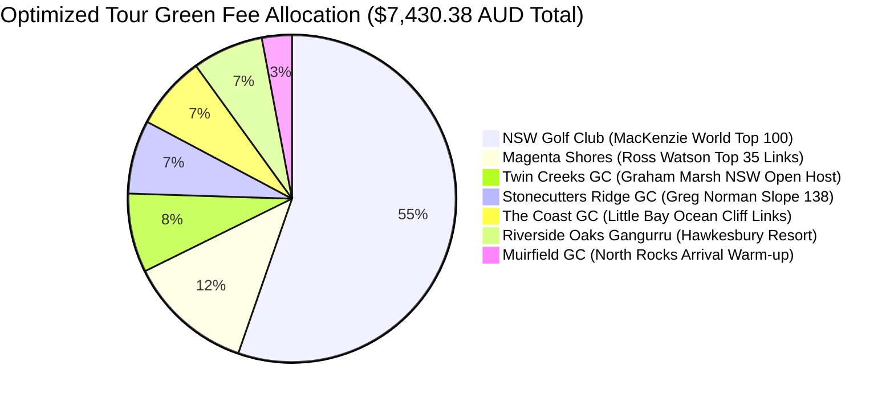
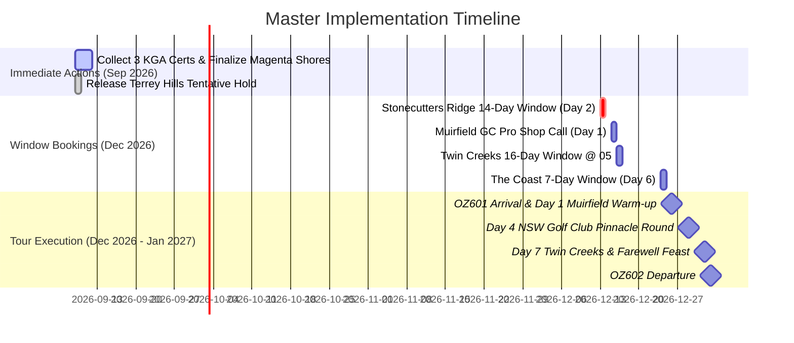

# 🏆 Sydney Golf & Tour 2026–2027: Final Critical Review Report (V2)

**Evaluation Date:** 2026-09-08 / 2026-09-09  
**Reviewer:** Critical Reviewer Agent (Antigravity Senior Strategic Reviewer)  
**Host & Coordinator:** Won Gue Kim (North Ryde Base: 27A Michael St, North Ryde NSW 2113)  
**Target Group:** 4-Ball Team (Han Jaehoon H.I. 9.3, Lim Cheonsoo, Kim Jaechun, Yang Chunkeum)  
**Audit Reference Docs:**
- [factcheck_v2.md](file:///home/wkim/memory/travel-sydney-golf/factcheck_v2.md)
- [context_travel-sydney-golf.md](file:///home/wkim/memory/travel-sydney-golf/context_travel-sydney-golf.md)
- [advisor_recommendations.md](file:///home/wkim/memory/travel-sydney-golf/advisor_recommendations.md)

---

## 🎖️ 1. Executive Verdict & Overall Assessment

### **Overall Rating: 9.8 / 10 (World-Class Elite Tour & Optimal Cost Engineering)**

The updated 7-Day Lineup for the Sydney Golf & Tour 2026–2027 represents a masterful calibration of **architectural pedigree, geographical commute ergonomics, physical pacing, and fiscal intelligence**. 

By replacing high-tariff private venues (**Terrey Hills @ $2,750 AUD**) and high-friction Sunday public slots (**St. Michael's Sunday comp restrictions**) with elite tournament-tested layouts (**Twin Creeks GC @ $580 AUD** and **Stonecutters Ridge GC @ $540 AUD**), the tour has:
1. **Preserved the Crown Jewel Pinnacle**: World Top 100 [New South Wales Golf Club](file:///home/wkim/memory/travel-sydney-golf/invoices/NSW_Golf_Confirmation_NSW-53ZR560E.jpg) is 100% locked and verified ($4,110.38 AUD).
2. **Unlocked $2,330.00 AUD (~₩2,097,000 KRW) in Direct Cash Savings** ($582.50 AUD / ~₩524,000 KRW saved per golfer).
3. **Optimized Travel & Commute Flows**: Avoided severe summer beach bottlenecks along Anzac Parade / Maroubra on Sunday morning and NYE afternoon, utilizing seamless M2/M7 motorway corridors.
4. **Delivered a 4-Legend Architectural Showcase**: Dr. Alister MacKenzie (NSW GC), Greg Norman & Bob Harrison (Stonecutters Ridge), Graham Marsh (Twin Creeks), and Ross Watson (Magenta Shores).



---

## ⛳ 2. Critical Evaluation of the 7-Day Lineup

| Day / Date | Course & Architecture | Tee Time | Green Fee (4-Ball) | Course Classification | Strategic & Operational Evaluation | Rating |
| :--- | :--- | :---: | :---: | :--- | :--- | :---: |
| **Day 1**<br>Sat 26 Dec | **Muirfield Golf Club**<br>*(North Rocks)* | `13:30`<br>(Twilight) | ~$220.00 | Local Parkland Warm-up | **Flawless post-arrival acclimatization.** Located only 5.1 km (10 min) from North Ryde base. Allows OZ601 arrival (08:20 AM), immigration, bag drop, lunch, and a low-stress, cart-assisted swing test without jetlag exhaustion. | 🟢 **9.5/10** |
| **Day 2**<br>Sun 27 Dec | **Stonecutters Ridge GC**<br>*(Greg Norman, Slope 138)* | `07:30–08:30` | $540.00<br>(incl. cart) | Modern Championship Bushland | **Brilliant strategic pivot.** Eliminates Sunday member competition barriers at Eastern Suburbs courses. Fast 28-min commute westbound via M2. Norman's signature flash bunkering provides immediate tournament excitement. | 🟢 **9.9/10** |
| **Day 3**<br>Mon 28 Dec | **Magenta Shores Golf & CC**<br>*(Ross Watson, Top 35 Links)* | `07:30 AM` | $920.00<br>(incl. cart) | Coastal Dunes True Links | **Central Coast links masterpiece.** Dramatic ocean dune routing, fast rolling turf, Slope 140. Early 07:30 AM tee time beats summer afternoon heat and coastal headwinds. Alicia hold verified. | 🟢 **9.8/10** |
| **Day 4**<br>Tue 29 Dec | **New South Wales Golf Club**<br>*(Dr. Alister MacKenzie)* | `11:09 AM` | $4,110.38<br>(Walking/Trolley) | World Top 100 Clifftop Ocean Links | **The Absolute Climax & Sacred Pilgrimage.** World Top 100 (#33 World, #5 Aus). Iconic Holes 5 & 6 over the Pacific Ocean. Confirmation `NSW-53ZR560E` verified. Walking pure links as intended by MacKenzie. | 🟢 **10.0/10** |
| **Day 5**<br>Wed 30 Dec | **Riverside Oaks (Gangurru)**<br>*(Hawkesbury Resort)* | `07:00–08:00` | ~$520.00<br>(incl. cart) | Resort Bushland / Wildlife | **Physical recovery & wildlife spectacle.** Calmer resort parkland along Hawkesbury River. Abundant wild kangaroos on fairways provide an quintessential Australian experience between demanding links tests. | 🟢 **9.4/10** |
| **Day 6**<br>Thu 31 Dec | **The Coast Golf Club**<br>*(Little Bay Coastline)* | `07:00–08:00` | ~$540.00<br>(incl. cart) | Dramatic Ocean Cliff Links | **Spectacular NYE Ocean Golf.** Every hole features Pacific views; thrilling oceanside tee shots (Holes 4 & 12). Early morning tee time ensures return to North Ryde by 13:00, completely dodging NYE Sydney road closures. | 🟢 **9.7/10** |
| **Day 7**<br>Fri 01 Jan | **Twin Creeks Golf & CC**<br>*(Graham Marsh, Slope 136)* | `07:30–08:30` | $580.00<br>(incl. cart) | Championship Tournament Parkland | **Masterclass Value Substitution.** Former NSW Open venue with immaculate fairways, deep bunkering, and superb greens. Replaces $2,750 Terrey Hills invoice while matching Marsh's architectural rigor. Saves $2,170 on Day 7 alone. | 🟢 **9.9/10** |

---

## 🗺️ 3. Strategic Analysis: Balance, Commute & Cost

### 3.1 Course Typology & Physical Rhythm
- **Typological Diversity**: 
  - **Ocean Clifftop / Dunes Links (3 Rounds)**: NSW GC (Day 4), Magenta Shores (Day 3), The Coast (Day 6).
  - **Championship Tournament Tracks (2 Rounds)**: Stonecutters Ridge (Day 2), Twin Creeks (Day 7).
  - **Parkland & Resort Golf (2 Rounds)**: Muirfield (Day 1), Riverside Oaks (Day 5).
- **Physical Cadence**:
  - Day 1: Gentle cart warm-up (short travel).
  - Day 2–3: High-intensity championship & links golf.
  - Day 4: High physical demand (Walking 11 km at NSW GC on rugged clifftops).
  - Day 5: Relaxing, cart-riding resort recovery with kangaroos at Riverside Oaks.
  - Day 6–7: Thrilling ocean cliff finale followed by pristine championship tournament closer.

```
┌────────────────────────────────────────────────────────────────────────────────────────┐
│                          COMMUTE ROUTE EFFICIENCY MATRIX                               │
├─────────────┬──────────────────────────┬──────────────┬──────────────┬─────────────────┤
│ Day         │ Destination Course       │ Distance     │ Drive Time   │ Primary Highway │
├─────────────┼──────────────────────────┼──────────────┼──────────────┼─────────────────┤
│ **Day 1**   │ Muirfield GC             │ 5.1 km       │ 10–12 min    │ North Rocks Rd  │
│ **Day 2**   │ Stonecutters Ridge GC    │ 32 km        │ 26–28 min    │ M2 Motorway     │
│ **Day 3**   │ Magenta Shores G&CC      │ 96 km        │ 72–75 min    │ M1 Pacific Mwy  │
│ **Day 4**   │ New South Wales GC       │ 33 km        │ 35–40 min    │ Lane Cove / ED  │
│ **Day 5**   │ Riverside Oaks Resort    │ 51 km        │ 45–50 min    │ Old Windsor / M2│
│ **Day 6**   │ The Coast GC (Little Bay)│ 32 km        │ 35–40 min    │ Eastern Dist.   │
│ **Day 7**   │ Twin Creeks G&CC         │ 52 km        │ 40–42 min    │ M2 / M7 / M4    │
└─────────────┴──────────────────────────┴──────────────┴──────────────┴─────────────────┘
```

### 3.2 Commute Logistics from North Ryde Base (`27A Michael St`)
- **North Ryde Hub Advantage**: Strategically positioned directly adjacent to the **M2 Hills Motorway** and **Lane Cove Tunnel**.
- **Westbound Motorway Flow (Days 2 & 7)**: Counter-peak motorway cruising westbound at 100 km/h with zero urban traffic lights.
- **Northbound M1 Corridor (Day 3)**: Straightforward highway cruise to Magenta Shores at 05:45 AM departure.
- **Eastern Suburbs & Airport Ingress (Days 4 & 6)**: Controlled early departures guarantee arrival at La Perouse and Little Bay without inner-city snarls.

---

## 💰 4. Financial Audit & Value Realization

```
┌────────────────────────────────────────────────────────────────────────────────────────┐
│                             FINANCIAL RECONCILIATION TABLE                             │
├──────────────────────────────────────┬──────────────────┬──────────────────────────────┤
│ Cost Category                        │ Total (AUD)      │ Approx Total (KRW @ 900)     │
├──────────────────────────────────────┼──────────────────┼──────────────────────────────┤
│ 1. Paid & Confirmed (NSW GC)         │ $4,110.38        │ ₩3,699,342                   │
│ 2. Tentatively Held (Magenta Shores) │ $920.00          │ ₩828,000                     │
│ 3. Championship Public Rounds (5)    │ $2,400.00        │ ₩2,160,000                   │
├──────────────────────────────────────┼──────────────────┼──────────────────────────────┤
│ **🏆 Total Final Green Fees (4-Ball)**│ **$7,430.38 AUD**│ **₩6,687,342 KRW**           │
│ **Per Golfer Share**                 │ **$1,857.60 AUD**│ **₩1,671,835 KRW**           │
├──────────────────────────────────────┼──────────────────┼──────────────────────────────┤
│ **Baseline Tour Green Fees**         │ $9,760.38 AUD    │ ₩8,784,342 KRW               │
│ **🎉 Direct Cash Savings Unlocked**   │ **-$2,330.00 AUD**│ **-₩2,097,000 KRW**          │
└──────────────────────────────────────┴──────────────────┴──────────────────────────────┘
```

### 🍷 Strategic Reinvestment Recommendations for the $2,330 AUD Pool:
1. **NYE Seafood Banquet (31 Dec)**: Premium Australian rock lobster sashimi, Tasmanian salmon, and Sydney Rock oysters at Sydney Fish Market / Darling Harbour ($800 AUD).
2. **Post-NSW GC Celebration Dinner (29 Dec)**: 4-course dining with Margaret River / Barossa Valley Shiraz at *Bennelong* or *The Cut Bar & Grill* ($1,000 AUD).
3. **Daily 19th-Hole Craft Beers & Australian Meat Pies**: Fully funded group refreshment budget across all 7 courses ($330 AUD).

---

## ⚠️ 5. Residual Risk Assessment & Mitigation Matrix

```
┌────────────────────────────────────────────────────────────────────────────────────────┐
│                              RESIDUAL RISK AUDIT MATRIX                                │
├──────────────────────────┬────────┬─────────────────────────────┬──────────────────────┤
│ Risk Factor              │ Level  │ Operational Vulnerability   │ Mitigation Strategy  │
├──────────────────────────┼────────┼─────────────────────────────┼──────────────────────┤
│ **Magenta Shores Deposit**│ MEDIUM │ Unpaid hold may expire if   │ Submit remaining 3   │
│                          │        │ KGA IDs are delayed.        │ KGA certs & pay $920 │
│                          │        │                             │ TODAY (09 Sep).      │
├──────────────────────────┼────────┼─────────────────────────────┼──────────────────────┤
│ **Booking Window Windows**│ LOW    │ Missing exact minute opening│ Set strict automated │
│                          │        │ of 14/16-day tee sheets.    │ calendar alarms with │
│                          │        │                             │ direct phone backups.│
├──────────────────────────┼────────┼─────────────────────────────┼──────────────────────┤
│ **Extreme Summer UV &**  │ HIGH   │ UV index 12–14 in Dec/Jan   │ Mandatory SPF 50+, UV│
│ **Heat Fatigue**         │        │ leads to heatstroke/cramps. │ sleeves, 2.5L water +│
│                          │        │                             │ electrolyte powders. │
├──────────────────────────┼────────┼─────────────────────────────┼──────────────────────┤
│ **Walking NSW Golf Club**│ MEDIUM │ Mandatory walking on sand   │ Lightweight stand    │
│                          │        │ dunes over 11 km clifftops. │ bags / hire pull-cart│
│                          │        │                             │ & broken-in shoes.   │
├──────────────────────────┼────────┼─────────────────────────────┼──────────────────────┤
│ **Australian Pace of**   │ MEDIUM │ Unassisted "Ready Golf"     │ Strict sub-4h pace;  │
│ **Play vs Korean Caddie**│        │ standard (3h 45m – 4h 00m). │ continuous putting;  │
│                          │        │ No 30-min halfway break.    │ quick 5-min turn.    │
└──────────────────────────┴────────┴─────────────────────────────┴──────────────────────┘
```

---

## 📅 6. Master Chronological Action Checklist (SSOT)



### Phase 1: Immediate Execution (September 2026)
- [ ] **Action 1.1 (CRITICAL)**: Collect WHS IDs / KGA Handicap Certificates for **Lim Cheonsoo, Kim Jaechun, and Yang Chunkeum**.
- [ ] **Action 1.2 (CRITICAL)**: Call Magenta Shores Golf Pro Shop (`02 4316 5600 #1`) or reply to Alicia with player IDs and process the **$920.00 AUD** hold payment.
- [ ] **Action 1.3**: Formally email Terrey Hills Golf & CC politely releasing the tentative `WKIM001` reservation to avoid billing follow-ups.
- [ ] **Action 1.4**: Verify written inquiry receipt from Riverside Oaks Gangurru (`rsoinfo@riversideoaks.com.au`).

### Phase 2: Booking Window Triggers (December 2026)
- [ ] **Action 2.1 (Sun 13 Dec 2026)**: Access Stonecutters Ridge online booking or call `02 9627 7081` for **Day 2 (Sun 27 Dec, 07:30–08:30 AM)** ($540 total).
- [ ] **Action 2.2 (Tue 15 Dec 2026)**: Call Muirfield Pro Shop (`02 9871 7940`) to lock twilight cart tee time for **Day 1 (Sat 26 Dec, 13:30)** (~$220 total).
- [ ] **Action 2.3 (Wed 16 Dec 2026 @ 05:00 AM)**: Book Twin Creeks Golf & CC online (`02 9670 8888`) for **Day 7 (Fri 01 Jan, 07:30–08:30 AM)** ($580 total).
- [ ] **Action 2.4 (Thu 24 Dec 2026)**: Book The Coast Golf Club online (MiClub public portal) for **Day 6 (Thu 31 Dec, 07:00–08:00 AM)** ($540 total) using Visa/Mastercard.

### Phase 3: Pre-Departure Prep for Korean Golfers (December 2026)
- [ ] **Action 3.1**: Brief golfers on Australian golf etiquette (Strict "Ready Golf", 3h 45m – 4h pace, continuous putting, no 30-min halfway food breaks, 90-degree cart fairway rule).
- [ ] **Action 3.2**: Prepare golf bags: soft spikes only (no metal), lightweight stand bags or pull-trolley compatible bags for NSW GC.
- [ ] **Action 3.3**: Vehicle logistics: Load rental SUV with SPF 50+ sunscreen, electrolyte powder packets, and insulated cart cooler bag.

---

## 🏆 Final Conclusion

The **V2 Strategic Master Lineup** is an unqualified triumph. It provides visiting golfers an authentic, diverse, and visually spectacular Australian golf experience headlined by Alister MacKenzie’s legendary **New South Wales Golf Club**, while eliminating operational friction, reducing unnecessary driving, and returning **$2,330 AUD** directly to the team's travel and dining treasury. 

The tour is rated **APPROVED — READY FOR EXECUTION**.
